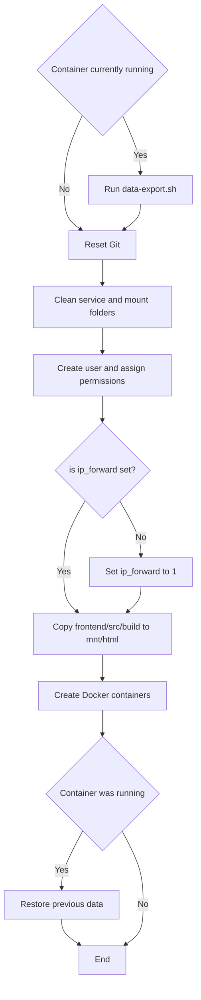

# deployment

[GitHub - SinglishWords/management: Some management operation](https://github.com/SinglishWords/management)

This repository consists of the working files and scripts for deploying all services of the SinglishWords project to a Docker container.

# Installation

## Prerequisites

First, clone this repository by using

```bash
$ git clone https://github.com/SinglishWords/deployment.git
$ cd deployment # to enter the directory
```

In order to create the container, we will need to install Docker. To do this, we can run

```bash
$ curl -fsSL https://get.docker.com -o get-docker.sh
$ sudo sh get-docker.sh
```

We will also need to install docker-compose in order to combine our different services into one container. To install docker-compose, run

```bash
$ sudo curl -L "https://github.com/docker/compose/releases/download/1.29.2/docker-compose-$(uname -s)-$(uname -m)" -o /usr/local/bin/docker-compose
$ sudo chmod +x /usr/local/bin/docker-compose
$ sudo ln -s /usr/local/bin/docker-compose /usr/bin/docker-compose
```

# Structure

The key folders in this repository are listed below

```
deployment
 |_ backend/      (service - backend)
 |_ frontend/     (service - frontend)
 |_ management/   (service - jupyter)
 |_ mysql/        (service - database)
 |_ redis/        (service - redis)
 |_ mnt/          (mount folder)
 |_ scripts/      (scripts folder)
```

The service folders contain the `Dockerfile` files and working files for each of the services.

The mount folder will contain the built files for the frontend, as well as other logs and initialisations that we wish to transfer to the Docker container during its creation.

The scripts folder will contain the shell scripts that allow for the automatic setup (see below) of the Docker container.

# docker-compose projections

In docker-compose, we set rules to define which folders in the local file system link to directories in the container. We define these rules in the `docker-compose.yml` file.

For example, we want to project the data in `mnt/html` to the container’s `/usr/share/nginx/html` for the `frontend` service. Then, in `docker-compose.yml`, under the `frontend` service, we define

```yaml
nginx:
    build: ./frontend
    restart: always
    image: singlishwords_nginx
    restart: always
    ports:
        - 80:80
        - 443:443
        - 8080:8080
    depends_on:
        - singlishwords_app
        - jupyter
    volumes:
        - ./mnt/config/nginx-conf/nginx.conf:/etc/nginx/nginx.conf
        - ./mnt/config/nginx-conf/conf.d:/etc/nginx/conf.d
        - ./mnt/log/nginx:/tmp/nginx
        - ./mnt/html:/usr/share/nginx/html
```

Here, we can see that the build folder is defined, the name of the Docker image is defined, the ports are defined, as well as the volume projections. The last line of the above block allows us to set a “link” between the `mnt/html` folder on the local file system to the `/usr/share/nginx/html` folder in the Docker container.

# Setup

This repository contains shell scripts that automates the refreshing of all the working files, and creation of the Docker container. The script can be found in `./scripts`. 

Ensure that you are in the `scripts` directory before executing the script. To run the script, use

```bash
$ cd scripts # in case you are not already in the folder
$ ./update.sh
```

After the script is run, you can verify that the containers are running by using

```yaml
$ docker ps -a
```

To verify that all the ports are being listened to correctly (we need to verify port 80/443/8080),

```yaml
$ netstat -anp
```

In order to pause the container services, use the below command. Note that this will still retain database information, unless the `-v` flag is used at the end of the command.

```yaml
$ docker-compose down
```

## Procedure



The procedure of this entire script involves

1. Export the data in the Docker container’s MySQL database, if any SinglishWords container is currently running.
    - This is done by running `data-export.sh`, a script that enters the Docker container and executes the Jupyter notebook `Data Export.ipynb` from the [management](https://github.com/SinglishWords/management) repo.
2. Overwrites all deployment files with the version that is currently on GitHub.
    1. Hence, any local changes made will be overwritten when the script is run. 
    2. In order to avoid this, delete the `fetch`, `reset`, and `merge` commands in the script on lines 9-11.
3. Cleans the service folders and the mount folder and re-clones the repositories so that the latest versions of the services are being deployed.
4. To simplify permissions, a user with `id 1000:1000` will be created, and the user will have write permissions for the deployment folder only.
5. The script will set `ip_forward` to `1`.
6. The script will copy the build files from the `frontend` folder to the mount folder `mnt/html`. This is why we recommended the building of React files in frontend when committing to the git..
7. The services are then built using docker-compose
8. The data that we backed up/exported in step 1 will be reimported into the container. If there was no preexisting container, then this step is skipped.

# Refreshing individual services

In order to refresh an individual service without having to run the above script and recreate the entire Docker container, we can use the following command while in the `deployment` directory

```bash
docker-compose build <service-name>
docker-compose up -d --no-deps <service-name>
```

The `<service-name>` to choose from are:

1. `backend`
2. `frontend`
3. `management`
4. `mysql`
5. `redis`